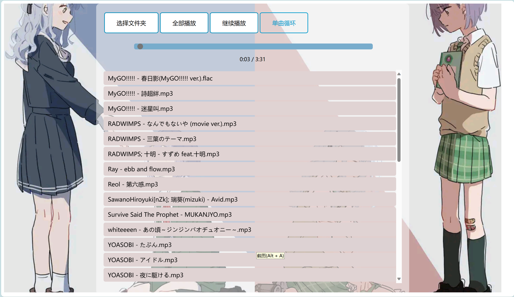

# 一个简单的基于Vue3的音乐播放器

### （0）前置准备

经典老三件：vscode，node.js，npm；

配置vue环境，可以参考：[Vue3.0（一）：创建Vue3项目-CSDN博客](https://blog.csdn.net/qq_23215957/article/details/115229225)

package.json：

```json
{
  "name": "the_player",
  "version": "0.1.0",
  "private": true,
  "scripts": {
    "serve": "vue-cli-service serve",
    "build": "vue-cli-service build",
    "lint": "vue-cli-service lint"
  },
  "dependencies": {
    "bootstrap": "^5.3.2",
    "core-js": "^3.8.3",
    "vue": "^3.2.13"
  },
  "devDependencies": {
    "@babel/core": "^7.12.16",
    "@babel/eslint-parser": "^7.12.16",
    "@vue/cli-plugin-babel": "~5.0.0",
    "@vue/cli-plugin-eslint": "~5.0.0",
    "@vue/cli-service": "~5.0.0",
    "eslint": "^7.32.0",
    "eslint-plugin-vue": "^8.0.3"
  },
  "eslintConfig": {
    "root": true,
    "env": {
      "node": true
    },
    "extends": [
      "plugin:vue/vue3-essential",
      "eslint:recommended"
    ],
    "parserOptions": {
      "parser": "@babel/eslint-parser"
    },
    "rules": {}
  },
  "browserslist": [
    "> 1%",
    "last 2 versions",
    "not dead",
    "not ie 11"
  ]
}

```


### （1）启动

只需要在根目录下启动终端，输入如下命令即可：

```
npm run serve
```

### （2）功能

功能很简单，大概就是”点击目录播放“，”全部播放“和”暂停“，以及一个简单的进度条，和显示音乐进度的数字。

因为没找的合适的API，所以直接简单粗暴地上传了本地文件夹。

css花了一些心思，但还是出现了小问题——不知道怎么才能让那三个按钮在同一行居中排列，因为我写的很乱，所以最后也不了了之了...

### （3）私货

掺带了一些个人的私货，把ico图标换了，大家可以点开来看看...

（求求你们都去看MyGO吧，我什么都会做的！）

### （4）代码

反反复复从简单到复杂写了好几个版本，比较适合初学者学习（大概）

（代码在src文件夹的app.vue中，这个应该不用说吧）

# 更新新功能（1.1）：

### （1）单曲循环模式：

点击后，可以使当前歌曲播放完之后重新播放。

样式上，点击后框的背景色会变成深蓝。

### （2）暂停渐弱：

暂停后音量会在500ms内归零，起到一个缓冲作用。

暂停和切换歌曲时会触发。

### （3）预览图（1.1）：



